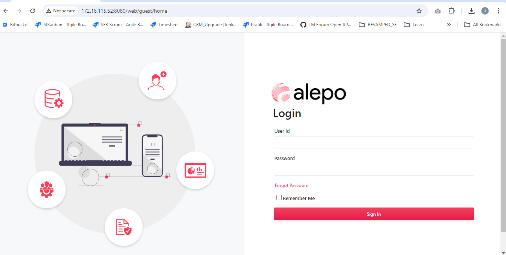
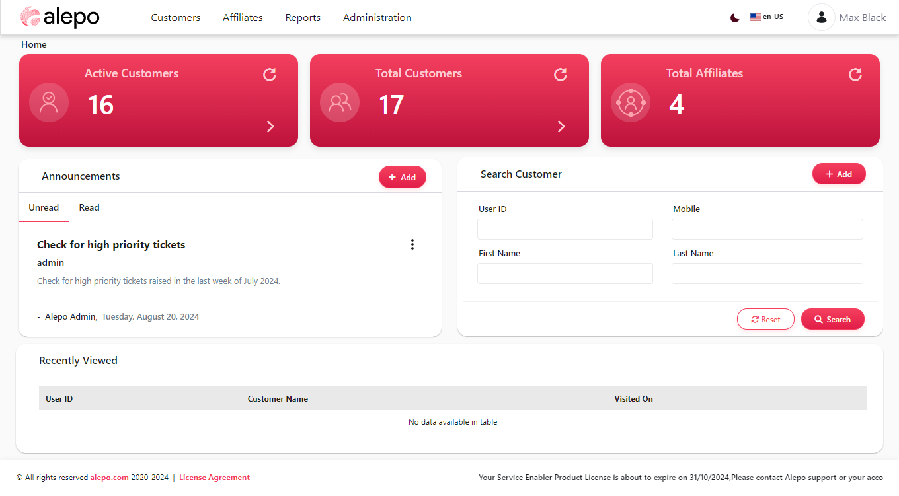

# Alepo Service Enabler Admin Guide

## Table of Contents

1. [About This Guide](#1-about-this-guide)
   - [1.1 Introduction](#11-introduction)
   - [1.2 Intended Audience](#12-intended-audience)
   - [1.3 Conventions](#13-conventions)
   - [1.4 Commonly Used Terms](#14-commonly-used-terms)
   - [1.5 Open Source Credits](#15-open-source-credits)
   - [1.6 How to Use This Guide](#16-how-to-use-this-guide)

2. [Getting Started](#2-getting-started)
   - [2.1 Logging In](#21-logging-in)
   - [2.2 Dashboard Overview](#22-dashboard-overview)
   - [2.3 Navigation Basics](#23-navigation-basics)

3. [Customers](#3-customers)
   - [3.1 Manage Customers](#31-manage-customers)
   - [3.2 Approve Customers](#32-approve-customers)
   - [3.3 Customer Documents](#33-customer-documents)
   - [3.4 Sessions / Calls](#34-sessions--calls)
   - [3.5 Billing](#35-billing)
     - [Bill Run Status](#bill-run-status)
     - [View Invoices](#view-invoices)
     - [Transferred Invoices](#transferred-invoices)
     - [View Payments](#view-payments)
     - [Quick Payment](#quick-payment)
     - [Balance Adjustment](#balance-adjustment)
     - [Financial Transactions](#financial-transactions)
     - [Proforma Billing](#proforma-billing)
   - [3.6 Tickets](#36-tickets)
   - [3.7 Provisioned Records](#37-provisioned-records)

4. [Affiliates](#4-affiliates)
   - [4.1 Manage Affiliates](#41-manage-affiliates)
   - [4.2 Affiliate Settings](#42-affiliate-settings)
   - [4.3 Cash Register](#43-cash-register)
     - [Manage Cash Register](#manage-cash-register)
     - [Cash Register Ledger](#cash-register-ledger)
     - [Cash Register Verification](#cash-register-verification)

5. [Reports](#5-reports)
   - [5.1 Bank Statement](#51-bank-statement)
   - [5.2 Gift Credit History](#52-gift-credit-history)
   - [5.3 Credit Line Statement](#53-credit-line-statement)
   - [5.4 Validity Adjustment](#54-validity-adjustment)
   - [5.5 Billing Promotion History](#55-billing-promotion-history)
   - [5.6 Data Bank Statement](#56-data-bank-statement)
   - [5.7 Reward Points Statement](#57-reward-points-statement)

6. [Administration](#6-administration)
   - [6.1 Business](#61-business)
     - [6.1.1 Usage Rating](#611-usage-rating)
     - [6.1.2 Policies](#612-policies)
     - [6.1.3 Plans](#613-plans)
     - [6.1.4 Inventory](#614-inventory)
     - [6.1.5 Tickets](#615-tickets)
   - [6.2 System Settings](#62-system-settings)
     - [6.2.1 Notification Framework](#621-notification-framework)
     - [6.2.2 System Configuration](#622-system-configuration)
     - [6.2.3 Configuration Manager](#623-configuration-manager)
     - [6.2.4 Custom Fields](#624-custom-fields)
     - [6.2.5 Server Nodes](#625-server-nodes)
     - [6.2.6 Payment Gateways](#626-payment-gateways)
     - [6.2.7 Pipeline Workflow](#627-pipeline-workflow)
     - [6.2.8 Provisioning Targets](#628-provisioning-targets)
   - [6.3 User Management](#63-user-management)
     - [6.3.1 Users](#631-users)
     - [6.3.2 Roles](#632-roles)
     - [6.3.3 Departments](#633-departments)
     - [6.3.4 Login Tracker](#634-login-tracker)
   - [6.4 Data Management](#64-data-management)
     - [6.4.1 Import / Export](#641-import--export)
     - [6.4.2 Archived Records](#642-archived-records)
     - [6.4.3 Purge Data](#643-purge-data)
   - [6.5 Audit Trail](#65-audit-trail)
     - [6.5.1 System](#651-system)
     - [6.5.2 Operations History](#652-operations-history)
   - [6.6 Logs](#66-logs)
     - [6.6.1 Bill Run Log](#661-bill-run-log)
     - [6.6.2 Provisioning Logs](#662-provisioning-logs)
     - [6.6.3 Web Payment Logs](#663-web-payment-logs)
     - [6.6.4 Direct Debit Logs](#664-direct-debit-logs)
     - [6.6.5 Dunning Logs](#665-dunning-logs)
     - [6.6.6 Failed Operations](#666-failed-operations)
   - [6.7 System Information](#67-system-information)
     - [6.7.1 Version](#671-version)
     - [6.7.2 License](#672-license)

7. [Appendices](#7-appendices)
   - [7.1 Glossary of Terms](#71-glossary-of-terms)
   - [7.2 Troubleshooting Common Issues](#72-troubleshooting-common-issues)
   - [7.3 Keyboard Shortcuts](#73-keyboard-shortcuts)
   - [7.4 System Requirements](#74-system-requirements)

# 1. About This Guide

## 1.1 Introduction

This comprehensive guide is designed to assist administrators in effectively managing the Alepo Service Enabler (SE) platform. Alepo SE is a powerful and versatile customer relationship management (CRM) and billing solution specifically tailored for telecommunications service providers. This guide covers all aspects of system administration, from basic navigation to advanced configuration options, ensuring you have the knowledge to maximize the platform's potential.

## 1.2 Intended Audience

This guide is primarily intended for:

- System administrators responsible for managing and maintaining the Alepo SE platform
- IT personnel involved in configuring and troubleshooting the system
- Customer service managers overseeing day-to-day operations
- Billing and revenue assurance teams working with financial aspects of the platform

Users should possess a basic understanding of telecommunications concepts and be familiar with web-based applications. While the guide aims to be comprehensive, some advanced topics may require additional technical expertise.

## 1.3 Conventions

To enhance readability and understanding, this guide uses the following conventions:

- **Bold text**: Indicates user interface elements, menu items, or buttons
- *Italic text*: Emphasizes important information or introduces new terms
- `Code font`: Represents system values, configuration settings, or commands
- > Note: Provides additional information or tips
- ⚠️ Warning: Highlights critical information or potential risks

## 1.4 Commonly Used Terms

To ensure clarity, here are some key terms used throughout this guide:

- **SE**: Service Enabler, the core Alepo platform
- **Subscriber**: An end-user of the telecommunications services
- **Plan**: A service package offered to subscribers
- **Billing Cycle**: The recurring period for which services are billed
- **Provisioning**: The process of activating services for a subscriber
- **CRM**: Customer Relationship Management
- **API**: Application Programming Interface
- **GUI**: Graphical User Interface

## 1.5 Open Source Credits

Alepo SE utilizes several open-source technologies in its architecture. For a comprehensive list of these components and their respective licenses, please refer to the [Open Source Credits](open-source-credits.md) document.

## 1.6 How to Use This Guide

To make the most of this guide:

1. **Navigation**: Use the table of contents to quickly find specific topics or features you need assistance with.

2. **Step-by-step Instructions**: Follow the numbered steps provided for performing tasks. These instructions are designed to be clear and concise.

3. **Screenshots**: Refer to the provided screenshots for visual guidance. These images will help you locate specific elements in the user interface.

4. **Related Topics**: Look for links to related sections for a more comprehensive understanding of interconnected features.

5. **Troubleshooting**: Consult the Appendices for common issues and their solutions. This section can be particularly helpful when encountering problems.

6. **Search Function**: Use your PDF reader's search function to quickly find specific terms or topics within the guide.

7. **Bookmarks**: Create bookmarks for frequently accessed sections to speed up navigation in future sessions.

For the latest updates, additional support resources, or to provide feedback on this guide, please visit our official documentation website or contact Alepo support through your designated channels.

# 2. Getting Started

## 2.1 Logging In

### Navigation
Home > Login

URL: 172.16.115.52:8080/web/guest/home

### Screenshot

### Describe
This screen allows users to securely access the Alepo Service Enabler platform. It provides the following benefits:
- Secure authentication for authorized users
- Option to remember login credentials for convenience
- Password recovery functionality

### Login Process
To log into the Alepo Service Enabler:

1. Navigate to the login URL in your web browser
2. Enter your User Id in the provided field
3. Enter your Password in the provided field
4. (Optional) Check the "Remember Me" box if you want the system to remember your login
5. Click the "Sign In" button to access the platform

If you've forgotten your password:
1. Click the "Forgot Password" link below the password field
2. Follow the prompts to reset your password

### List of fields

| Field Name | Mandatory | Description |
|------------|-----------|-------------|
| User Id | Yes | The unique identifier for your account. This is typically provided by your system administrator. |
| Password | Yes | Your secure password associated with the User Id. |
| Remember Me | No | A checkbox that, when selected, allows the system to remember your login credentials for future sessions. |

### Additional notes
- Ensure you're using a secure network when logging in to protect your credentials.
- If you're unable to log in after multiple attempts, contact your system administrator for assistance.
- For security reasons, avoid using the "Remember Me" feature on shared or public computers.
- The system may lock your account after a certain number of failed login attempts as a security measure.

## 2.2 Dashboard Overview

### Navigation
Home > Dashboard

URL: [dashboard_url_placeholder]

### Screenshot

### Describe
The Dashboard screen provides an at-a-glance view of key metrics and functionalities within the Alepo Service Enabler (SE). It offers the following benefits:
- Quick access to customer and affiliate statistics
- Ability to view and create announcements
- Easy customer search functionality
- Overview of recently viewed customer profiles

### Dashboard Components

#### 1. Key Metrics
At the top of the dashboard, three key metrics are displayed:

1. **Active Customers**: Shows the number of currently active customers (16 in the example).
2. **Total Customers**: Displays the total number of customers in the system (17 in the example).
3. **Total Affiliates**: Indicates the number of affiliates associated with the service (4 in the example).

Each metric card has a refresh button (circular arrow icon) to update the data and a forward arrow for potential detailed views.

#### 2. Announcements Section
The Announcements section allows administrators to view and manage system-wide notifications.

- **Tabs**:
  - Unread: Displays unread announcements
  - Read: Shows previously read announcements

- **Add Button**: Clicking this opens the announcement entry form

#### 3. Search Customer
This section provides a quick way to find customer information:

- **Fields**: User ID, Mobile, First Name, Last Name
- **Buttons**:
  - Reset: Clears all entered data
  - Search: Initiates the search based on entered criteria
- **Add Button**: Likely leads to a new customer creation form

#### 4. Recently Viewed
This table shows a list of recently accessed customer profiles, including:
- User ID
- Customer Name
- Visited On (timestamp of last access)

### Announcement Entry Process

To create a new announcement:

1. Click the **Add** button next to the Announcements section.
2. In the Entry form that appears, fill in the following fields:
   - **Title**: Enter a concise, descriptive title for the announcement (mandatory).
   - **Content**: Use the rich text editor to compose the announcement body. Tools include text formatting, lists, links, and more.

#### Announcement Entry

3. Under the **CONFIGURATION** section, set the following:
   - **Distribution Scope**: Choose the audience for the announcement (default: General).
   - **URL**: Enter a relevant URL if applicable.
   - **Type**: Select the announcement type (default: General).
   - **Priority**: Set the importance level (default: Normal).
   - **Display Date**: Set when the announcement should become visible (default: current date and time).
   - **Display Immediately**: Check this box to make the announcement visible right away.
   - **Expiration Date**: Set when the announcement should no longer be displayed.

4. Click **Save** to publish the announcement or **Cancel** to discard changes.

### List of fields

| Field Name | Mandatory | Description |
|------------|-----------|-------------|
| Title | Yes | A brief, descriptive title for the announcement |
| Content | Yes | The main body of the announcement, supports rich text formatting |
| Distribution Scope | Yes | Determines who can see the announcement (e.g., General, Specific departments) |
| URL | No | An optional link related to the announcement |
| Type | Yes | Categorizes the announcement (e.g., General, Maintenance, Alert) |
| Priority | Yes | Sets the importance level of the announcement (e.g., Normal, High, Urgent) |
| Display Date | Yes | The date and time when the announcement becomes visible |
| Display Immediately | No | When checked, makes the announcement visible right away, overriding the Display Date |
| Expiration Date | Yes | The date and time when the announcement will no longer be displayed |

### Additional notes
- The dashboard provides a centralized location for accessing key system functions and viewing important metrics.
- Announcements are a crucial tool for communicating with users across the system. Use them judiciously to avoid information overload.
- The customer search function on the dashboard allows for quick access to customer information without navigating to a separate search page.
- Recently viewed customers are tracked to provide easy access to frequently accessed profiles.
- Ensure that announcements are clear, concise, and targeted to the appropriate audience to maximize their effectiveness.